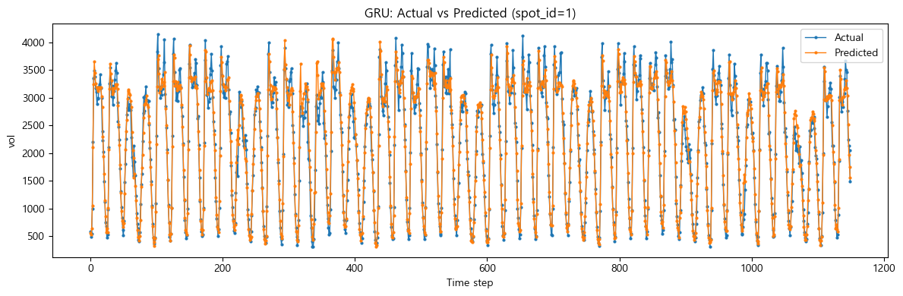
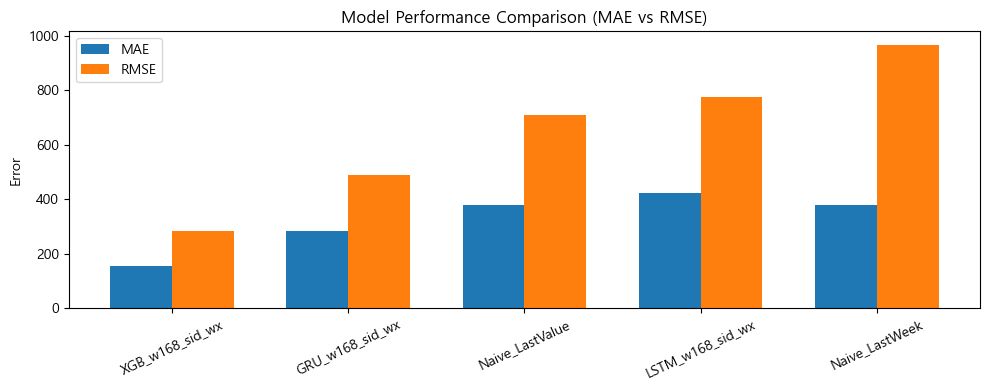
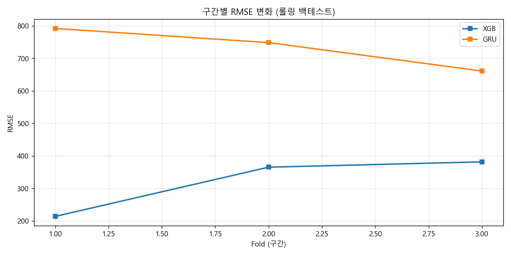
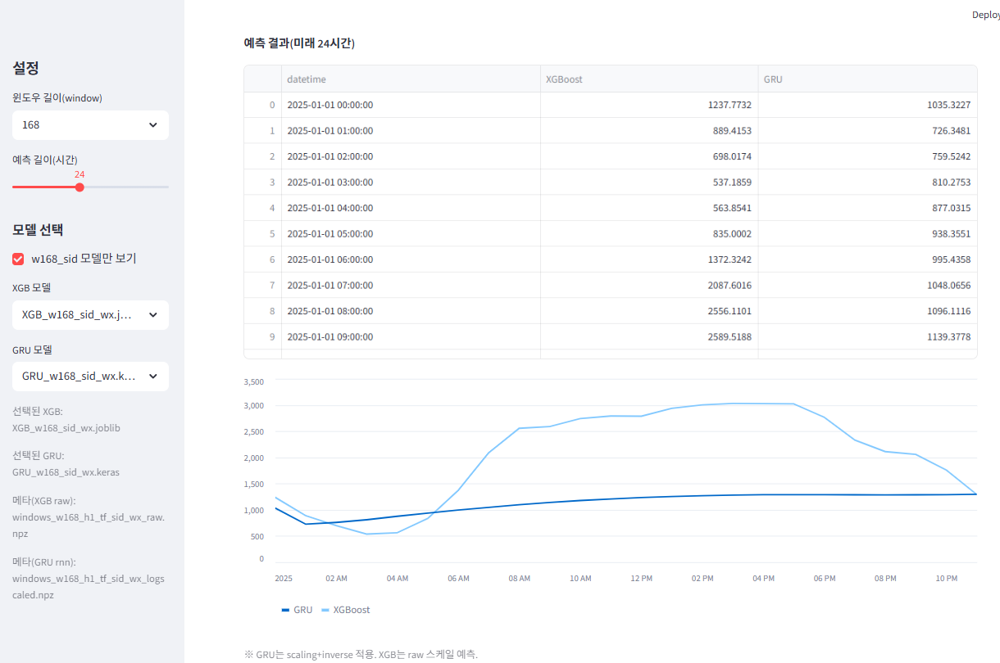

# 교통량 예측 (Time Series Forecasting)

서울시 교통량·기상 데이터를 활용한 **시계열 교통량 예측 프로젝트**입니다.  
딥러닝(LSTM/GRU)과 머신러닝(XGBoost)을 비교하여,  
**데이터 특성에 가장 적합한 모델을 선택하는 과정**에 초점을 맞췄습니다.

---

## TL;DR
- **문제 정의**: spot(지점)별 시간 단위 교통량 예측
- **접근**: 시계열 윈도우 기반 학습 + 기상 변수 결합
- **모델 비교**: XGBoost vs LSTM vs GRU
- **평가**: MAE / RMSE / MAPE + 롤링 백테스트
- **결론**: DL보다 **XGBoost가 더 안정적인 성능**
- **결과물**: 예측 시각화 및 Streamlit 대시보드

---

## Actual vs Predicted Traffic Volume


> 실제 교통량과 예측값을 시계열로 비교하여  
> 모델이 시간적 패턴을 얼마나 잘 학습했는지 확인했습니다.

---

## Model Performance Comparison


> 딥러닝 모델과 트리 기반 모델을 비교한 결과,  
> 데이터 특성상 **XGBoost가 더 안정적인 예측 성능**을 보였습니다.

---

## Rolling Backtest


> 단일 테스트 분할이 아닌 **롤링 백테스트**를 통해  
> 실제 운영 환경에서의 예측 안정성을 검증했습니다.

---

## Streamlit Dashboard


> 예측 결과와 성능 지표를  
> 직관적으로 확인할 수 있도록 대시보드로 시각화했습니다.

---

## 주요 기능
- **전처리**: 시계열 윈도우 생성(build_dataset, make_windows)
- **모델**: XGBoost, LSTM, GRU
- **평가**: MAE / RMSE / MAPE, 롤링 백테스트
- **시각화**: 예측 결과 그래프 및 대시보드

---

## 환경 요구사항
- Python 3.10+
- (선택) GPU 환경 시 TensorFlow CUDA 지원

---

## 설치 및 실행
```bash
python -m venv .venv
.venv\Scripts\activate
pip install -r requirements.txt
